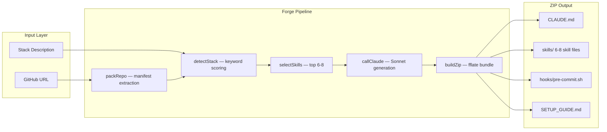
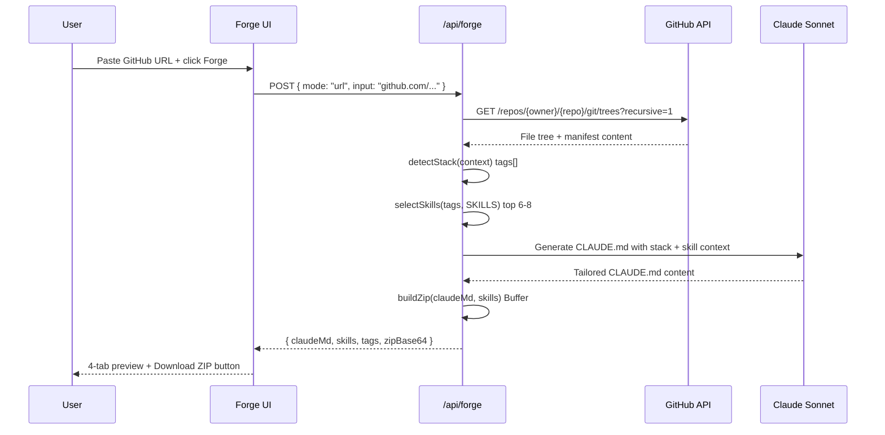
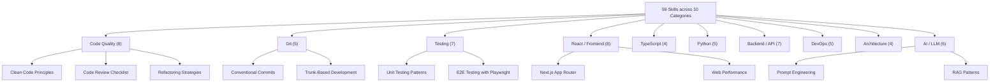

# CLAUDE.md Forge

**59 curated Claude Code skills, auto-selected and bundled for any GitHub repository in 30 seconds.**


CLAUDE.md Forge is a Next.js utility site that analyzes any GitHub repository — or a plain-text stack description — and generates a complete Claude Code configuration: a tailored `CLAUDE.md`, a curated skill pack, pre-commit hooks, and a setup guide, all bundled into a downloadable ZIP. Paste a URL, click Forge, drop the ZIP in your project root. Claude Code reads it automatically every session.

---

## What it does

- **Auto-detect your stack** — Forge reads your repository's manifest files (`package.json`, `tsconfig.json`, `pyproject.toml`, `go.mod`, `Cargo.toml`, etc.) and identifies your exact technology stack
- **Score and select skills** — From a library of 59 curated Claude Code skills, Forge scores each one against your detected stack tags and selects the 6–8 most relevant
- **Generate a tailored CLAUDE.md** — Claude Sonnet writes a project-specific context file using Karpathy-inspired engineering principles, scoped to your detected stack and selected skills
- **Bundle everything** — Output is a ZIP with `CLAUDE.md`, individual skill markdown files, a `pre-commit.sh` hook, and a `SETUP_GUIDE.md`
- **Browse the full library** — Every skill is searchable and filterable at `/skills` with category filters, difficulty levels, stack tags, and copy-paste snippets

---

## Key features

| Feature | Description |
|---|---|
| 59 Skills | Production-ready Claude Code context files covering code quality, architecture, testing, Git, security, DevOps, AI/LLM, and more |
| 12+ Stacks | Auto-detection for Next.js, React, TypeScript, Python, Go, Rust, Docker, GraphQL, Prisma, Playwright, and more |
| Fast forge | GitHub URL scan uses manifest-file extraction — no full clone, stays fast even on large monorepos |
| ZIP output | Drop `claude-forge-output/` directly into your project root; Claude Code reads it on every session start |
| Skill library | Browse, filter by category, and copy any of the 59 skills individually at `/skills` |
| Rate-limited API | 5 forges per IP per day — keeps the service free without requiring an account |

---

## Showcase site

```
https://claudemdforge.site
```

Browse the full skills library, see example CLAUDE.md outputs, and download your custom Claude Code setup.

---

## Architecture overview



---

## Forge flow



---

## Skill catalog



---

## Tech stack

| Layer | Technology |
|---|---|
| Framework | Next.js 16.2 (App Router, Turbopack) |
| Language | TypeScript (strict) |
| Styling | Tailwind CSS v4 — `@theme {}` block in CSS, no config file |
| Fonts | Syne · DM Sans · DM Mono · Instrument Serif via `next/font/google` |
| ZIP building | fflate — ESM-native, synchronous, runs in Node.js API routes |
| AI generation | `@anthropic-ai/sdk` → `claude-sonnet-4-20250514`, max 2 000 tokens |
| GitHub API | REST v3 — recursive tree + raw manifest fetch, no OAuth required |
| Rate limiting | In-memory Map, 5 forges per IP per day, resets midnight UTC |
| Deploy | Vercel (root directory) |

---

## Installation

```bash
# 1. Clone
git clone https://github.com/spooky-may/project-forge.git
cd project-forge

# 2. Install dependencies
npm install

# 3. Set environment variables
# Create .env.local:
#   ANTHROPIC_API_KEY=sk-ant-...
#   GITHUB_TOKEN=ghp_...    <- optional, raises GitHub API rate limit

# 4. Start development server
npm run dev
# -> http://localhost:3000
```

| Variable | Required | Description |
|---|---|---|
| `ANTHROPIC_API_KEY` | Yes | Anthropic API key for Claude Sonnet calls |
| `GITHUB_TOKEN` | No | GitHub PAT — raises rate limit from 60 to 5 000 req/hr |

---

## Project structure

```
project-forge/
├── app/
│   ├── layout.tsx              <- Root layout, Google fonts, metadata
│   ├── page.tsx                <- Landing page — hero, forge, how-it-works, footer
│   ├── globals.css             <- Design tokens, component classes, animations
│   ├── api/forge/
│   │   └── route.ts            <- POST /api/forge — full generation pipeline
│   └── skills/
│       └── page.tsx            <- /skills — 59-skill browsable library
│
├── components/
│   ├── ForgeCard.tsx           <- URL / describe input, step animation, API call
│   ├── ResultPreview.tsx       <- 4-tab preview + copy + download ZIP
│   ├── SkillsGrid.tsx          <- Search + category filter + 59-card grid
│   ├── SkillModal.tsx          <- Skill detail overlay with snippet
│   ├── Reveal.tsx              <- IntersectionObserver scroll-reveal wrapper
│   └── PageWrapper.tsx         <- Page entry animation wrapper
│
└── lib/
    ├── skills.ts               <- 59-skill data array, Skill type, CATEGORIES
    ├── github.ts               <- packRepo() — GitHub manifest extraction
    ├── detectStack.ts          <- Keyword analysis -> string[] tags
    ├── selectSkills.ts         <- Scoring engine — tag overlap + universal weight
    ├── claude.ts               <- callClaude() — Anthropic SDK call
    ├── buildZip.ts             <- fflate ZIP builder -> Buffer
    └── rateLimit.ts            <- In-memory 5/IP/day limiter
```

---

## Skill selection algorithm

Each of the 59 skills has a `tags` array (e.g. `['typescript', 'react', 'nextjs']`). The scoring engine in `lib/selectSkills.ts` computes:

```
score = (skill.tags intersect detectedTags).length
      + 0.3  if skill has 'universal' tag
```

Skills are sorted by score descending. Top 6–8 are selected, with at minimum one `universal` skill always included. Skills with no tag overlap are excluded unless tagged `universal`.

---

## Attribution

Skill content is curated from open-source community resources:

- [awesome-claude-code](https://github.com/hesara/awesome-claude-code) (MIT) — community-maintained Claude Code skill library
- Karpathy engineering philosophy — principles adapted from Andrej Karpathy's public writing on coding and AI
- [Repomix](https://github.com/yamadashy/repomix) (MIT) — repository packing methodology used in the URL scan pipeline

CLAUDE.md Forge is an independent project and is not affiliated with or endorsed by Anthropic.

## License

MIT
